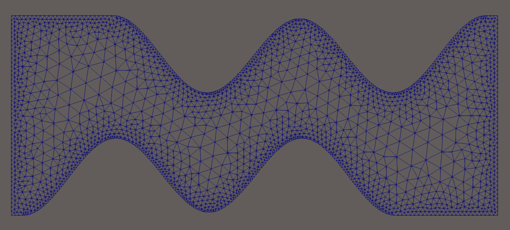
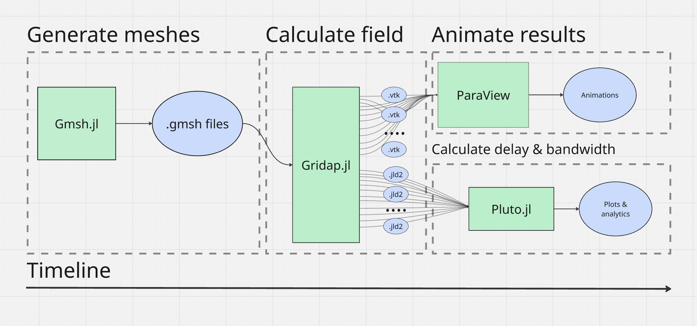
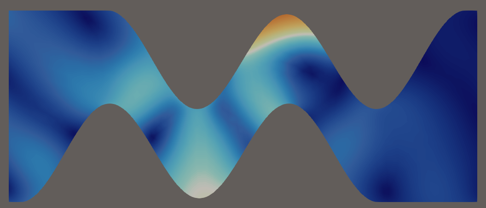
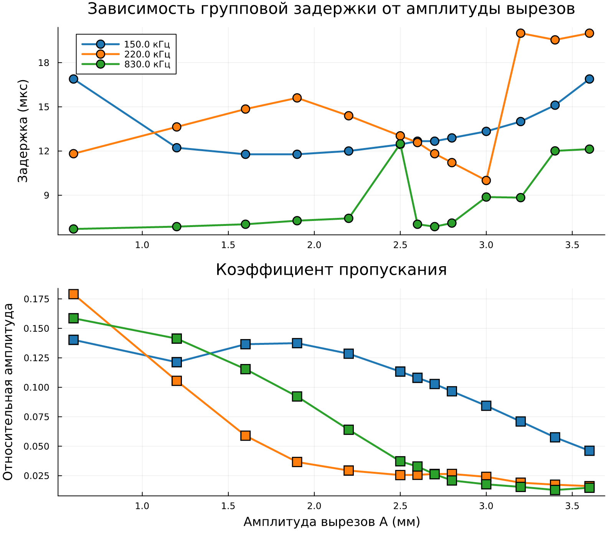

\begin{titlepage}
\begin{center}
Московский государственный университет им. М. В. Ломоносова\\
Физический факультет\\
Кафедра акустики

\vspace{6cm} % Жестко отступаем вниз до середины листа

{\Large \textbf{Курсовая работа}}\\[0.5cm]
{\LARGE \textbf{Численное моделирование акустического метаматериала \\
с синусоидальными вырезами \\
на основе открытого пакета Gridap.jl \\
}}
\end{center}

\vspace{3cm} % Отступ до блока с авторами

\hfill % Эта команда "толкает" блок вправо
\begin{minipage}{0.45\textwidth} % Создаем невидимую коробку, чтобы текст внутри был выровнен по левому краю
\textbf{Работу выполнил:}\\
студент 4 курса 424 группы\\
физического факультета\\
Парфенов М.А.\\[0.5cm]
\textbf{Научные руководители:}\\
Одина Н.И., Кокшайский А.И.
\end{minipage}

\vfill

\begin{center}
Москва — 2026
\end{center}
\end{titlepage}

\setcounter{page}{2}

\renewcommand{\contentsname}{Содержание}
\tableofcontents

\newpage

# Введение

Метаматериалы - это искусственные структуры, которые состоят из элементарных ячеек с характерным размером много меньше длины волны, которые могут проявлять специфичные свойства, не характерные для природных материалов. Благодаря этим свойствам, метаматериалы открывают широкие перспективы для решения инженерных задач, таких как: фокусировка акустических пучков, частотная фильтрация и др.

## Проблема задержки волн без дисперсии
Для задач фокусировки акустических пучков и частотной фильтрации, необходимо создать метаматериал, позволяющий управлять фазовой или групповой задержкой акустических импульсов. Для создания такой задержки, нам необходимо увеличить геометрический путь, проходимый акустическим импульсом в метаматериале.[Zhu et al.] и [Memoli et al.] уже решали подобную задачу: авторы создали несколько ячеек с прямоугольными каналами для воздуха. Так как в воздушной среде распространяются только продольные волны, наличие острых углов в каналах не приводило к критическим искажениям. Однако, для реализации подобных ячеек-волноводов в твердом теле, требуется наложить условие непрерывности производной на границе волновода. При наличии разрывов первой производной, будет происходить сильная дифракция и конверсия мод - перекачка части энергии продольных волн в поперечные. Соответственно, для успешной реализации задержки акустического импульса, геометрия каналов должна быть $С^1$- непрерывной.

Поэтому, в данной работе в качестве элементарной ячейки метаматериала исследуется структура из фотополимера с гладкими синусоидальными вырезами. 

Для численного моделирования распространения акустических волн в метаматериале применяется open-source фреймворк Gridap.jl на языке Julia, который обеспечивает высокую производительность для решения уравнений в частных производных методом конечных элементов.

Цель работы - исследовать распространение звуковых волн акустическом в метаматериале с синусоидальными вырезами.

Задачи: 
1) Разработать конечноэлементную модель упругой среды в пакете Gridap.jl.
2) Исследовать спектр пропускания для различных амплитуд вырезов.
3) Исследовать зависимость групповой задержки от амплитуды вырезов.
4) Выявить частотные режимы с различным характером этой зависимости.

# Теория

## Уравнения для акустических волн в твердом теле

Для распространения возмущений в твердом теле имеем уравнение:

$$
\rho \frac{\partial^2 \mathbf{u}}{\partial t^2} = \nabla \cdot \boldsymbol{\sigma} + \mathbf{f}
\tag{2.1}
$$

где $\rho$ — плотность материала, $\boldsymbol{\sigma}$ — тензор напряжений Коши.

Для изотропного материала связь между тензором напряжений $\boldsymbol{\sigma}$ и тензором малых деформаций $\boldsymbol{\varepsilon} = \frac{1}{2}(\nabla \mathbf{u} + (\nabla \mathbf{u})^T)$ задается обобщенным законом Гука:

$$
\boldsymbol{\sigma}(\mathbf{u}) = \lambda \text{tr}(\boldsymbol{\varepsilon})\mathbf{I} + 2\mu\boldsymbol{\varepsilon}
\tag{2.2}
$$

где $\mathbf{I}$ — единичный тензор, а $\lambda$ и $\mu$ — параметры Ламе, которые однозначно выражаются через скорости продольных ($c_p$) и поперечных ($c_s$) волн: $\mu = \rho c_s^2$ и $\lambda = \rho c_p^2 - 2\mu$.

Для учета поглощения волны в фотополимере, были взяты данные из [Акустические характеристики фотополимерного материала]. С учетом демпфирования тензор напряжений модифицируется:

$$
\boldsymbol{\sigma}_{tot} = \boldsymbol{\sigma}(\mathbf{u}) + \beta \boldsymbol{\sigma}\left(\frac{\partial \mathbf{u}}{\partial t}\right)
\tag{2.3}
$$

$$
\rho \frac{\partial^2 u_i}{\partial t^2} + \alpha \rho \frac{\partial u_i}{\partial t} = \frac{\partial \sigma_{ij}^{tot}}{\partial x_j}
\tag{2.4}
$$

Коэффициенты $\alpha$ и $\beta$ взяты из работы [Акустические характеристики фотополимерного материала].

## Граничные условия

Для имитации бесконечной среды вокруг исследуемого материала, использовались граничные условия с поверхностной нагрузкой, поглощающей падающие продольные и поперечные волны.

$$
\mathbf{t}_{abs} = \rho c_p (\dot{\mathbf{u}} \cdot \mathbf{n})\mathbf{n} + \rho c_s (\dot{\mathbf{u}} - (\dot{\mathbf{u}} \cdot \mathbf{n})\mathbf{n})
\tag{2.5}
$$

где $\mathbf{n}$ — вектор нормали, $\dot{\mathbf{u}} = \partial \mathbf{u} / \partial t$ — вектор скорости точек среды.

Возбуждение волны задается на границе $\Gamma_{in}$ в виде давления $P_l(t)$, модулированного окном Ханна (Hanning window) для ограничения ширины спектра импульса:

$$
P_l(t) = P_{amp} \cdot \frac{1}{2} \left[1 - \cos\left(\frac{2\pi t}{T_d}\right)\right] \sin(2\pi f_0 t), \quad 0 \le t \le T_d
\tag{2.6}
$$

где $P_{amp}$ — амплитуда давления, $f_0$ — центральная частота импульса, $T_d = 4/f_0$ — длительность импульса, равная четырем периодам.

## Метод конечных элементов

Для численного решения методом конечных элементов задача формулируется в слабой (вариационной) форме. Задача заключается в поиске функции смещений $\mathbf{u} \in U$, такой, что для любой допустимой тестовой функции $\mathbf{v} \in V_0$ выполняется интегральное тождество:

$$
\int_\Omega \left( \rho \ddot{\mathbf{u}} \cdot \mathbf{v} + \alpha \rho \dot{\mathbf{u}} \cdot \mathbf{v} + \beta \boldsymbol{\sigma}(\dot{\mathbf{u}}) : \boldsymbol{\varepsilon}(\mathbf{v}) + \boldsymbol{\sigma}(\mathbf{u}) : \boldsymbol{\varepsilon}(\mathbf{v}) \right) d\Omega +
$$
$$
+ \int_{\Gamma_{out}} (\mathbf{t}_{abs} \cdot \mathbf{v}) d\Gamma_{out} + \int_{\Gamma_{in}} (\mathbf{t}_{abs} \cdot \mathbf{v}) d\Gamma_{in} = \int_{\Gamma_{in}} P(t) (\mathbf{n} \cdot \mathbf{v}) d\Gamma_{in}
\tag{2.7}
$$

## Схема Ньюмарка

Интегрирование по времени осуществлялось с помощью неявного метода Ньюмарка (Newmark-$\beta$) с параметрами $\gamma = 0.5$ и $\beta = 0.25$. По сравнению с явными схемами (например, RK4), данная схема является безусловно устойчивой и не вносит численного затухания, что критически важно для корректного анализа физического поглощения и групповой задержки, а также позволяет использовать более крупную сетку.

## Вычисление групповой задержки

В общем случае, мы ожидаем что импульс на выходе из метаматериала будет сильно искажен, поэтому вычисление групповой задержки по положению макимума выходного импульса может давать ошибочные результаты. Для находждения групповой задержки импульса произвольной формы обычно используется вейвлет-преобразование. Однако, в нашей задаче исходный импульс имеет простую форму. Поэтому, для определения групповой задержки при прохождении сигнала через метаматериал мы ищем точку с максимальной корреляцией между нормированными огибающими входного и выходного сигнала. 

$$
z_{in}(t) = P_{in}(t) + i \mathcal{H}\{P_{in}(t)\}, \quad z_{out}(t) = P_{out}(t) + i \mathcal{H}\{P_{out}(t)\}
\tag{2.8}
$$

$$
E_{in}(t) = |z_{in}(t)|, \quad E_{out}(t) = |z_{out}(t)|
\tag{2.9}
$$

$$
R(\tau) = \int_{-\infty}^{\infty} E_{in}(t) E_{out}(t + \tau) dt
\tag{2.10}
$$

$$
\tau_{delay} = \arg\max_{\tau} R(\tau)
\tag{2.11}
$$

# Описание численной модели

## Геометрические параметры

Для проведения численных экспериментов была построена двумерная геометрическая модель, конфигурация и размеры которой соответствуют реальным физическим образцам из фотополимера, используемым в параллельных лабораторных экспериментах. 

Образец представляет собой прямоугольник длиной $L = 17$ мм и шириной $W = 7$ мм. На верхней и нижней гранях прямоугольника смоделированы гладкие периодические сужения. 

На длине образца укладывается ровно 2 пространственных периода. Варьируемым геометрическим параметром в исследовании выступала амплитуда выреза $A$, характеризующая глубину проникновения геометрии внутрь образца с каждой стороны. В процессе расчетов параметр $A$ изменялся в диапазоне от 0.0 до 3.6 мм.

На левой границе образца ($x = 0$) задавалась граница возбуждения импульса, на правой границе($x = 17$ мм) — граница считывания прошедшего сигнала. Верхняя и нижняя искривленные границы моделировались как акустически свободные поверхности.

Геометрия описывалась программой на языке Julia и строилась с помощью Gmsh. Нужно было моделировать несколько сеток с различными параметрами, поэтому написание программы для автоматизации оказалось эффективнее использования инструментов для 3D моделирования. Модели фотополимера из этой программы также можно экспортировать для 3D печати.

## Параметры фотополимера

Значения плотности и скоростей распространения упругих волн были получены из экспериментальных данных: $\rho = 1210$ кг/м$^3$, $c_l = 2340$ м/с, $c_t = 1170$ м/с, $\alpha = 79560$ с$^{-1}$, $\beta = 2,5 \cdot 10^{-9}$ с.

## Параметры сетки

Для генерации сетки использовалась программа Gmsh через интерфейс Julia.
 Для оптимизации вычислений, шаг сетки адаптивно изменялся в зависимости от частоты исследуемого импульса $f_0$, и в зависимости от геометрии. Вблизи границ, шаг сетки сделан более мелким ($h_{min} = 0,15$ мм) (см. рис.1, пример сетки).

 Поскольку для разных частот исходного сигнала выбирался разный шаг дискретизации во времени ($\Delta t = 1/(30f_0)$), перед проведением основного массива расчетов была выполнена стандартная для численных методов проверка на сеточную сходимость. Был проведен контрольный расчет, в котором размер конечного элемента и шаг по времени были уменьшены в два раза. Сравнение показало, что при дальнейшем измельчении сетки и шага результат вычисления групповой задержки изменяется менее чем на 1%. Это доказывает, что выбранный шаг дискретизации является достаточным, и решение сошлось к истинному физическому значению, представляя собой оптимальный баланс между точностью и временем счета.

## Вычисление

Для вычисления поля напряжений внутри фотополимера был выбран пакет Gridap.jl. В отличие от COMSOL Multiphysics, данный пакет является открытым и распространяется на все типы ОС. Также, он не обладает вычислительными ограничениями и легко масштабируется на вычислительные мощности. Это позволило использовать 6 потоков процессора с минимальными изменениями в коде. Кроме того, этот пакет легко интегрируется с нейросетями для будущих задач.

Интегрирование по времени выполнялось на интервале от $0$ до $60$ мкс. Шаг интегрирования $\Delta t$ выбирался адаптивно в зависимости от центральной частоты исследуемого импульса $f_0$ из условия разрешения одного периода колебаний минимум 30 точками: $\Delta t = \frac{1}{30 f_0}$. Это обеспечило устойчивость схемы Ньюмарка и минимизировало ошибки численной дисперсии при распространении коротковолновых пакетов.

Стоит отметить, что для пространственной дискретизации использовались линейные конечные элементы. Для компенсации численной дисперсии, характерной для элементов первого порядка при волновых расчетах, применялось значительное локальное сгущение сетки (до 35 узлов на длину волны в зонах концентрации напряжений). В качестве дальнейшего развития модели (например, моделирования акустической линзы) планируется переход на базисные функции Лагранжа второго и более высоких порядков, что позволит снизить вычислительную нагрузку при сохранении точности.

## Архитектура программы.

Весь вычислительный пайплайн, включая генерацию геометрии, построение сетки, решение дифференциальных уравнений и постобработку сигналов, был реализован на высокопроизводительном языке программирования Julia. 

Поскольку целью работы являлся расчёт отклика среды для множества комбинаций частот имусльсов $f_0$ и амплитуд вырезов $A$ — задача была оптимизирована с помощью многопоточных вычислений. Вычисление каждой конфигурации является независимым, что позволило одновременно рассчитывать несколько конфигураций, задействуя несколько потоков процессора (см.рис. 2, архитектуру вычислений).

Для обеспечения потокобезопасности при параллельном обращении к C-библиотеке генератора сеток `Gmsh` и стандартному потоку вывода применялись механизмы взаимного исключения (мьютексы). Подобная архитектура кода позволила масштабировать вычисления практически линейно относительно количества доступных ядер процессора, радикально сократив общее время компьютерного моделирования.

# Результаты

## Визуализация поля 

Визуализация распространения акустического импульса была проведена в программе `ParaView`. На рисунке 3 представлен снимок распределения модуля вектора смещений в один из моментов времени.

Анализ анимации распространения позволяет увидеть несколько ключевых физических эффектов, определяющих свойства данного метаматериала. 

Во-первых, изначальный импульс искажается, проходя через геометрические препятствия в образце. Во-вторых, в областях сужения канала наблюдается локальный максимум амплитуды смещений. Также, наблюдается отражение волны от частей синусоиды и распространение смещений в обратном направлении. Наличие обратного рассеяния формирует сложную интерференционную картину внутри образца и образует запрещенные частотные зоны.

## Энергетическое пропускание и формирование запрещенных зон

Помимо групповой задержки, была исследована энергетическая характеристика — коэффициент пропускания. Коэффициент пропускания вычислялся как отношение глобального максимума огибающей прошедшего сигнала к максимуму огибающей падающего импульса. Совмещенные графики задержки и пропускания представлены на Рис. 4.

Анализируя коэффициент пропускания, можно сделать следующие выводы про зависимость групповой задержки от амплитуды синусоидальных вырезов для различных частот.
Для длинноволнового импульса, пропускание снижается линейно с ростом $A$. Обладая большой длиной волны, импульс эффективно огибает препятствия за счет дифракции. Даже при максимальном сужении канала ($A = 3.6$ мм) сохраняется значительный уровень прошедшей энергии, что обеспечивает монотонный и предсказуемый рост задержки без нелинейных скачков.

На длине волны, соотетствующей характерным размерам ячейки ($f_0 \approx 220$ кГц), коэффициент пропускания стремительно падает и уже при амплитуде вырезов $A \ge 2.5$ мм опускается ниже уровня $0.03$. Резкие скачки групповой задержки, наблюдаемые на верхнем графике при $A > 2.5$ мм, физически соответствуют именно этой зоне отражения. В таком режиме алгоритм кросс-корреляции фиксирует задержку остаточного дисперсионного хвоста, просочившегося через структуру. Для такой конфигурации, делать выводы о групповой задержке по максимуму кросс-корреляции нельзя.

На более высоких частотах импульс распространяется в виде узкого луча. До амплитуды $A \approx 2.4$ мм коэффициент пропускания большой, а групповая задержка остается неизменной. Однако при превышении этого порога геометрия вырезов перекрывает центральную зону волновода. Это приводит к падению пропускания и возникновению многократных переотражений от стенок, что выражается в нелинейных скачках времени задержки.

Таким образом, совместный анализ кинематических и энергетических характеристик доказал, что синусоидальная геометрия позволяет эффективно управлять не только задержкой акустической волны, но и формировать выраженные запрещенные зоны.

# Дальнейшие перспективы развития работы

Проведенное исследование закладывает фундаментальную базу для проектирования сложных волновых устройств. В качестве ближайшего этапа развития данной работы планируется создание конечноэлементной модели акустической мета-линзы. Линза будет представлять собой пространственный массив из рассмотренных в работе ячеек с плавно изменяющейся (градиентной) амплитудой вырезов $A$. Используя полученные в данной работе графики зависимости задержки от амплитуды (калибровочные кривые), можно подобрать такой пространственный профиль геометрии, который обеспечит требуемый фазовый сдвиг для фокусировки плоского волнового фронта в заданную точку пространства.

Кроме того, выбранный программный стек (язык `Julia`, сеткогенератор `Gmsh` и решатель `Gridap.jl`) обладает высокой производительностью и возможностью автоматического дифференцирования. Это открывает перспективы для интеграции созданной численной модели с алгоритмами машинного обучения. Планируется реализация пайплайна активного обучения (Active Learning) нейронной сети для решения сложной нелинейной обратной задачи: автоматического синтеза оптимальной геометрии образца по заданным целевым характеристикам — требуемой групповой задержке и ширине запрещенной зоны.

# Заключение

В настоящей работе была разработана и программно реализована физически строгая модель распространения акустических волн в твердотельном метаматериале с гладкими синусоидальными вырезами. Модель реализована в открытом пакете `Gridap.jl`.

Проведено параметрическое исследование влияния амплитуды синусоидальных вырезов на спектр пропускания и время групповой задержки акустического импульса. Выявлено и физически обосновано существование трех различных режимов работы метаматериала, связывающего характерные размеры ячейки с частотой входящего импульса. 
Доказано, что предложенная структура твердотельного метаматериала позволяет эффективно и предсказуемо управлять коэффициентом пропускания и задержкой групповой скорости акустического импульса. Эффективность кода открывает дальнейшие перспективы исследования метаматериалов, например решение обратной задачи и моделирование акустических линз.

# Список литературы
1) Dmitriev K. V., Smirnykh D. V. Two-step scattering theory method for designing metamaterials // Journal of Physics: Conference Series. – 2024. – Vol. 2822. – Article 012145. – DOI: 10.1088/1742-6596/2822/1/012145
2) Memoli G. et al. Metamaterial bricks and quantization of meta-surfaces // Nat. Commun. – 2017. – Vol. 8. – 14608. – DOI: 10.1038/ncomms14608.
3) Zhu X., Li K., Zhang P., Zhu J., Zhang J., Tian C., Liu S. Implementation of dispersion-free slow acoustic wave propagation and phase engineering with helical-structured metamaterials // Nature Communications. – 2016. – Vol. 7. – Article number 11731. – DOI: 10.1038/ncomms11731.
4) Павлов И.С., Васильев А.А., Дмитриев С.В. Акустические волны в градиентной модели метаматериала из сферических частиц // Акустический журнал. – 2024. – Т. 70. – № 55. – С. 29–30
5) Павлов И.С., Зайцев В.В., Дмитриев С.В., Васильев А.А. Дисперсионные свойства акустического метаматериала, моделируемого цепочкой сферических частиц «масса-в-массе» // Акустический журнал. – 2025. – Т. 71. – № 55. – С. 101
6) Канев Н.Г., Миронов М.А. Звуковые волны в среде с резонансными включениями дипольного типа // Акустический журнал. – 2024. – Т. 70. – № 4. – С. 478–484.
7) Павлов И. С., Монич Д. В., Ерофеев В. И. и др. Новые конструктивные решения легких бескаркасных перегородок с акустическим разобщением торкрет-облицовок // Строительная механика и расчет сооружений. — 2023. — № 5 (310). — С. 31–36.
8) Павлов И. С., Ерофеев В. И., Монич Д. В. Метаматериалы: экспериментальные исследования, математическое моделирование, перспективы применения // Проблемы прочности и пластичности. — 2021. — Т. 83. — № 4. — С. 412–425.
9) Farajollahi A., Seyyed Fakhrabadi M. M. Convolutional neural networks to predict dispersion surfaces-based properties of acoustic metamaterials with arbitrary-shaped unit cells // Results in Engineering. – 2025. – Vol. 26. – Article number 104905. – DOI: 10.1016/j.rineng.2025.104905.
10) Kumar S. R. S., Krishnadas V. K., Balasubramaniam K., Rajagopal P. Waveguide metamaterial rod as mechanical acoustic filter for enhancing nonlinear ultrasonic detection // APL Materials. – 2021. – Vol. 9. – Issue 6. – Article number 061115. – DOI: 10.1063/5.0051412.
